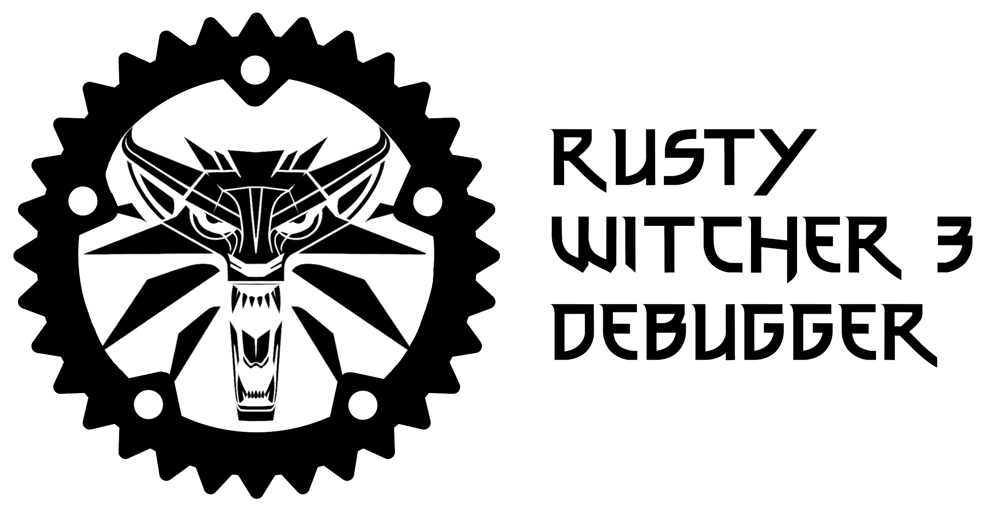

A set of utilities implementing the network protocol used by Witcher 3 written in Rust.
The repository includes:
- `rw3d_net` - core library implementing the network protocol and known messages
- `rw3d_net_client` - client for `rw3d_net`
- `rw3d_cli` - Command Line Interface tool utilizing the aformentioned client

`rw3d_cli` is intended for Witcher 3 modders who make mainly script based mods.
The main features of it include recompiling game scripts at run time, monitoring scripts log and remotely running exec functions in game, which can greatly help during mod development.

Parts of this code are based off of `Wolvenkit modding tool` by Traderain, rfuzzo and others
https://github.com/WolvenKit/WolvenKit

---


## Usage

In order to use this tool one of two requirements must be met:  
1. The game must have been launched with following debug arguments[^1]: -net -debugscripts.
2. A REDkit project must be opened

[^1]: You can either create a shortcut to the executable and add those arguments at the end or configure launch parameters in Steam/GOG. 

Print help information.
```ps1
rw3d_cli.exe help
rw3d_cli.exe help <SUBCOMMAND>
```

Recompile game scripts.
```ps1
rw3d_cli.exe reload
```

Recompile scripts specifically for an active REDkit project.
```ps1
rw3d_cli.exe --target=editor reload
```

Recompile scripts specifically for a game being launched with debug arguments.
```ps1
rw3d_cli.exe --target=game reload
```

Remotely call an exec function from the game. Remember to use quotation marks for the command argument.
```ps1
rw3d_cli.exe exec "spawn('Nekker', 3)"
```

Execute a command without artificial delays and extra logs. Useful when using the CLI as a backend for other tools.
```ps1
rw3d_cli.exe --no-delay --log-level=output-only exec "logstats()"
```

Monitor game's scripts log and highlight lines that include specific keywords. You can set multiple key words to be highlighted with the same color.
```ps1
rw3d_cli.exe scriptslog --yellow="[My mod]" --yellow="[Also my mod]"
```

Monitor game's scripts log and filter out non-highlighted lines.
```ps1
rw3d_cli.exe scriptslog --red="[My mod]" -f
```

Print the list of mods installed.
```ps1
rw3d_cli.exe modlist
```

Print the root path of game's scripts.
```ps1
rw3d_cli.exe rootpath
```

Print the opcode for a script function.
```ps1
rw3d_cli.exe opcode -f "IsCiri" -c "CR4Player"
```

Print the list of config variables.
```ps1
rw3d_cli.exe varlist
```